Analysis of congressional speeches
================

Sánchez, Catalunya, and "Negativity"
====================================

Introduction
------------

On Wednesday, December 12th, Spanish President Pedro Sánchez delivered an address to the Congreso de los Diputados regarding Brexit and the political situation in Catalonia ([official transcription here](http://www.congreso.es/public_oficiales/L12/CONG/DS/PL/DSCD-12-PL-170.PDF)). The speech has been intepreted by the media as reflecting rising tensions between pro-independence Catalans and the pro-union Sánchez government, marking a sharp break with Sánchez's previous more conciliatory tone towards Catalonia.

The question
------------

Was Sánchez's tone in regards to Catalonia in general, and the Catalan pro-independence movement in particular, quantifiably "negative"?

Or it perhaps that pro-independence Catalans are interpreting the speech too harshly?

The methods
-----------

We digitized the speech from December 12 into a [machine-readable format](https://github.com/joebrew/vilaweb/blob/master/inst/rmd/sesion_de_control/data/transcript.csv).

We then classified every set of sentences into one of eight themes:

<table style="width:100%">
<tr>
    <td>1. Independentisme català</td>
    <td>Any sentence referencing Catalonia and the independence movement (identified algorithmically through the phrases "secession", "independentista", "independencia", "unilateralitat")</td>

</tr>
    <tr>
    <td>2. Balkans</td>
    <td>Sentences referencing former Yugoslavia</td>

</tr>
<tr>
    <td>3. Brexit i Catalunya</td>
    <td>Sentences in which both Brexit and Catalonia were mentioned</td>

</tr>
<tr>
    <td>4. Catalunya</td>
    <td>Sentences in which only Catalonia-related issues were referenced</td>

</tr>
<tr>
    <td>5. Brexit</td>
    <td>Sentences in which only Brexit-related issues were referenced</td>

</tr>
<tr>
    <td>6. Espanya</td>
    <td>Sentences in which general Spain issues were referenced</td>

</tr>
<tr>
    <td>7. Europa</td>
    <td>Sentences in which general European issues were referenced</td>

</tr>
<tr>
    <td>8. Misc</td>
    <td>Miscellaneous sentences which did not fit the previous categories</td>

</tr>
</table>
Finally, we used an algorithm based on the [AFINN library](http://www2.imm.dtu.dk/pubdb/views/publication_details.php?id=6010) (a dictionary of words with assigned sentimental polarity) to classify each sentence's average emotional direction. Certain words are categorized as positive or negative, with -5 being the most negative (for example, "bastard", "slut") and +5 being the most positive (for example, "superb" (magnífico) or "thrilled" (encantado)). The majority of words do not have an emotional weight ("to act", "chair", "walk", etc.) and are classified as 0. The average of a sentence's emotionally-weighted words constitute its positivity.

The below is an example of how the algorithm works on an actual sentence from Pedro Sánchez's speech. The sentence contained some negative words and some positive words, and was classified as neutral (0).

<table style="width:100%">
<tr>
    <td></td>

</tr>
</table>
We ran the algorithm on the entire content of the speech, and analyzed trends in positivity. We also examined overall average sentimentality per each of the above themes.

Results
-------

### Sentimentality trajectory

The below shows the overall sentiment trajectory of the Sánchez speech. The speech begins with discussion of the Balkans and Catalonia, followed by a long comparison between Brexit and Catalan independence, before going into more detail on Brexit, Spain's political situation, and Europe, and then looping back to Catalonia and Brexit. Each dot shows the sentimentality of a sentence, with the solid lines indicating the 15-sentence theme-specific rolling sentimental average. Sentences above 0 are emotionally positive, whereas those below 0 are emotionally negative.

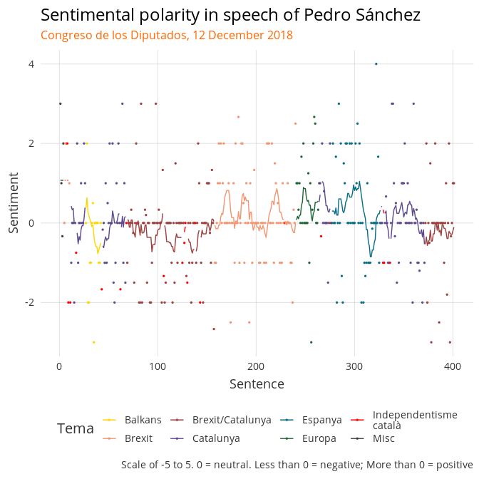

### Sentimentality by theme

We examined average sentence sentimentality for each of the 8 pre-categorized themes. Emotional sentiment was most positive when discussing Europe and most negative when discussing Catalan independence. Oddly, Catalan independence was associated with even greater negative polarity words than sentences related to the Balkans or Brexit.

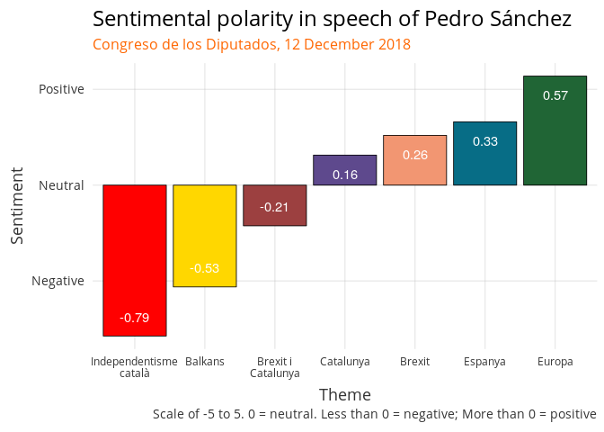

ALTERNATIVE TO ABOVE VISUALIZATION

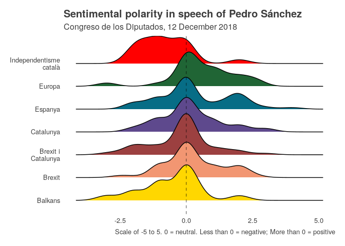

Conclusion
----------

Sánchez used significantly more emotionally negative words when referencing the Catalan independence movement than when discussing other themes.

Technical details
-----------------

All code for this analysis is openly available at <https://github.com/joebrew/vilaweb/blob/master/inst/rmd/sesion_de_control/README.md>.

Catalan language plots
----------------------

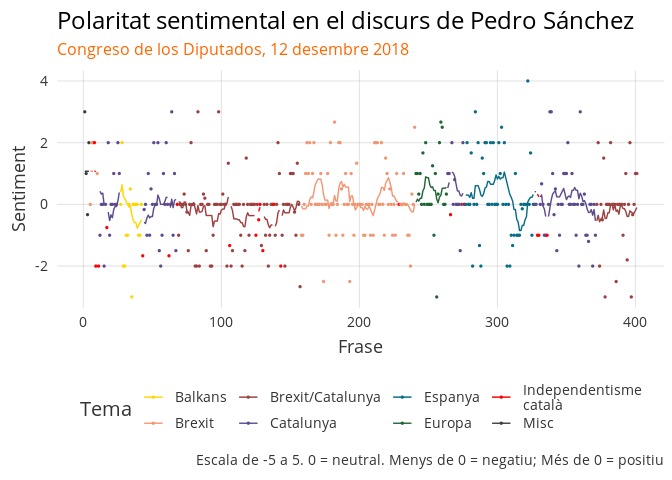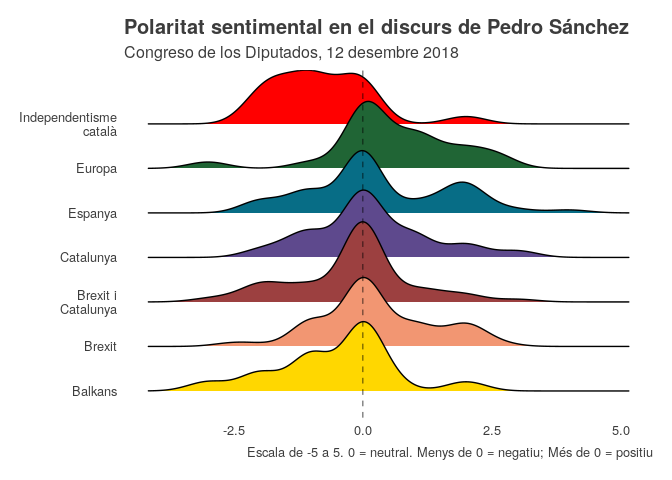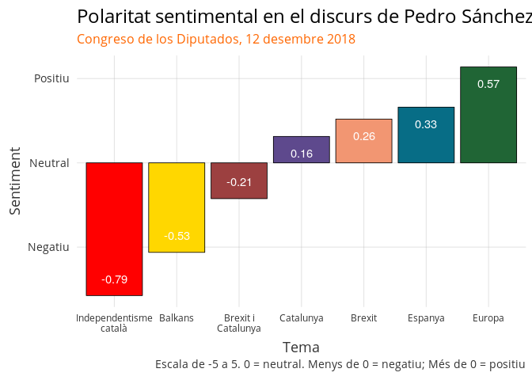

FIN.

                                       

More detailed analysis (probably not going to publish)
======================================================

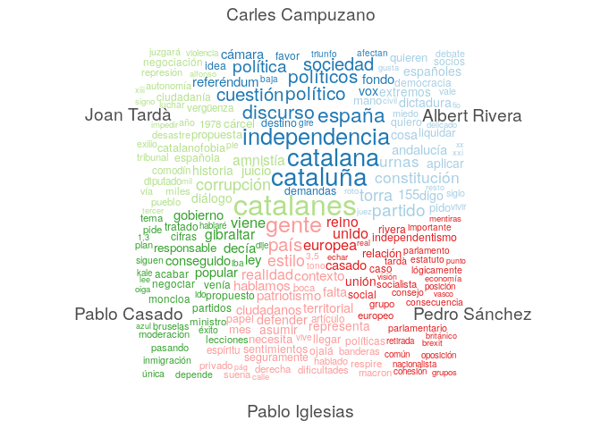

The following back-and-forth between Sánchez and the leaders of other major Spanish political parties was tense, and marked by repeated references to violence.

What follows is linguistic analysis of the speeches and counter-speeches of 6 politicians:

-   Pedro Sánchez (President, PSOE, unionist)
-   Pablo Casado (PP, unionist)
-   Albert Rivera (Ciudadanos, unionist)
-   Pablo Iglesias (Podemos, ambivalent)
-   Carles Campuzano (PDeCat, independentist)
-   Joan Tardà (Catalan Left, independentist)

The questions
-------------

1.  Are there differences in "polarity" (postivity-negativity) between the different politicians' speeches?

2.  Does polarity change when different subjects are discussed (specifically, Catalonia)?

3.  Are there differences in complexity between different politicians' speeches?

The methods
-----------

We digitized the speeches from December 12 into a [machine-readable format](https://github.com/joebrew/vilaweb/blob/master/inst/rmd/sesion_de_control/data/transcript.csv), and then used an algorithm based on the [AFINN library](http://www2.imm.dtu.dk/pubdb/views/publication_details.php?id=6010) (a dictionary of words with assigned sentimental polarity) to classify each sentence's average emotional direction, excluding the question and answer section at the end. Certain words are categorized as positive or negative, with -5 being the most negative (for example, "bastard", "slut") and +5 being the most positive (for example, "superb" (magnífico) or "thrilled" (encantado)). The majority of words do not have an emotional weight ("to act", "administration", "aquí", etc.) and are classified as 0. The average of a sentence's emotionally-weighted words constitute its positivity.

The below is an example of how the algorithm works on an actual sentence from Pedro Sánchez's speech. The sentence contained some negative words and some positive words, and was classified as neutral.

<table style="width:100%">
<tr>
    <td></td>

</tr>
</table>
We ran the algorithm on the entire content of speeches, and analyzed trends in positivity. We also tabulated word frequencies and associations. Finally, we ran an analysis on lexical diversity (ie, the complexity of each politicians' speech) in an effort to better understand who their messaging targetted.

The results
-----------

### Are there differences in "polarity" (postivity-negativity) between the different politicians' speeches?

Yes.

Of the 6 speakers examined, 4 had generally "negative" speeches, whereas 2 had "positive" speeches.

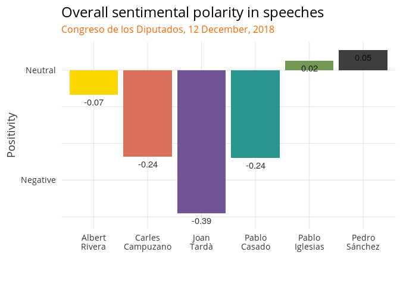

Since Sánchez delivered a formal written address, it should come as no surprise that his speech was the most positive (generally formal speeches are more positive than the critiques that follow them). And since and Iglesias' Podemos party is the main supporter of the Sánchez government, it should also came as no surprise that his speech was net positive.

### Does polarity change when different subjects are discussed (specifically, Catalonia)?

Yes.

The previous chart oversimplifies very large changes in positivity throughout each person's interventions. For example, in the below, we can see wide swings in emotionality. About 1/4 through Sánchez's opening speech, for example, he hit his emotional low point. What was he talking about then? Catalonia.

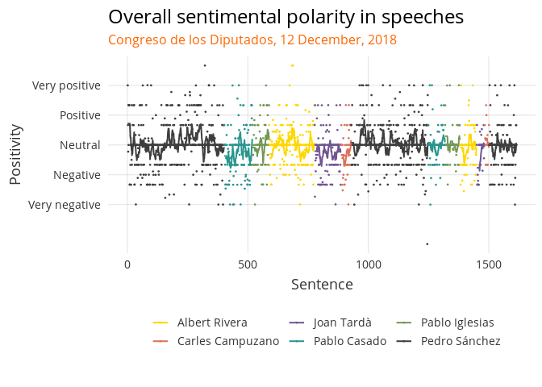

In fact, if we filter for only those sentences which contained references to Catalonia\*, the emotional polarity values take on a radically different form. If we only examine sentences in which Catalonia is mentioned, we see that all non-independence parties sentimentality becomes more negative, whereas the 2 pro-independence politicians' speech becomes more positive.

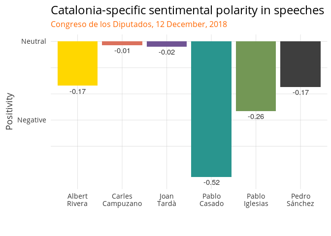

The below shows sentimentality over the course of the speeches, filtering only for sentences in which Catalonia is referenced. Note that the large majority of the sentiment curves are below 0 (ie, negative).

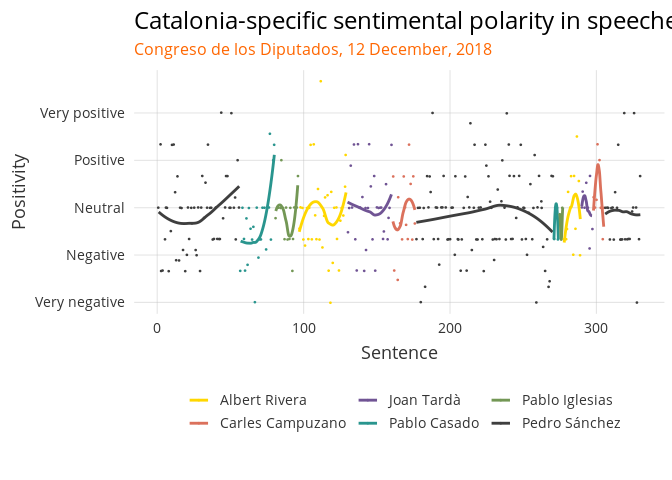

#### Are there differences in complexity between different politicians' speeches?

Lexical diversity is a measure of how many different words are used (ie, how often one repeats words). It is a reflection of how complex or advanced a speech is. For example, children have much lower lexical diversity than adults.

A speech with high lexical diversity generally correlates with a complicated message. A speech with low lexical diversity among politicians does not generally reflect low intelligence (most politicians are smart), but rather an intentional effort to target a specific audience with simplistic, repetitive messaging. Donald Trump, for example, has become infamous for simple, repetive slogans; his speeches, to no surprise, have very low lexical diversity.

TTR (Type-Token Ratio) is a measure of lexical diversity. Here, it refers to the number of unique words used in any given 100 word sequence. For example, if one repeated the same word 100 times, the TTR would be 1. If one said 100 words and did not repeat at all, the TTR would be 100. The higher the TTR, the higher the level and complexity of speech.

The below chart shows TTR for each politician analyzed.

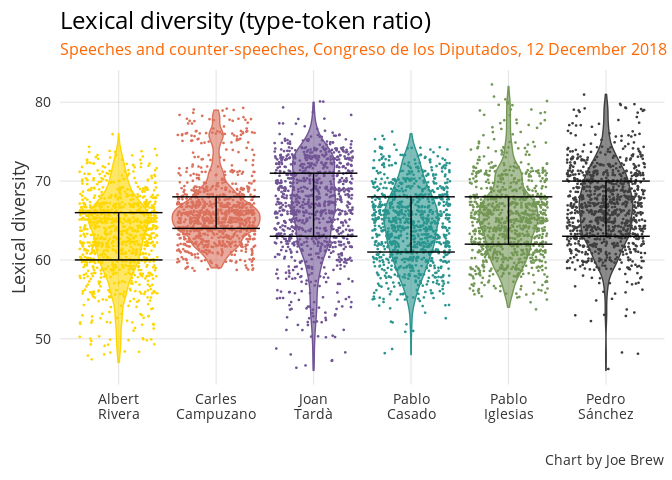

The below shows the percentage of 100 word sequences with a very low TTC (below 60). In other words, these are 100 word sequences in which the 40% of the words have already been said.

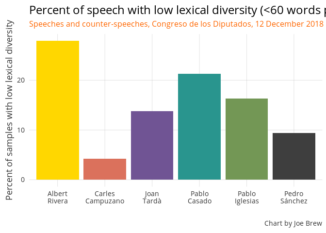

Lexical diversity is lowest among Albert Rivera and Pablo Casado, suggesting a more Trump-like messaging style (ie, targetting a less ophisticated audience and aiming for sound bites).

Qualitative interpretation
--------------------------

In this analysis we have seen that (a) much of what is said at the Congreso is negative, (b) negativity is higher when speaking about Catalonia than about other topics, and (c) there are drastically different levels of speech complexity among different politicians.

Much of this emotional negativity is attributible to violence-related words. For example, Albert Rivera used the words golpe (4), guerra (1), muertos (2), terrorismo (1), and violencia (1). Pablo Casado took on a similar tone, saying golpe/golpista (3), violencia (2), but adding more evocative, specific words like batasunización (1), balcanizar (1), and kale borroka (1). The irony of violence vocabulary is that once it is injected into the discourse, even those who deny it still end up talking about it. For example, even Joan Tardà used the words golpe (3) and violencia/violentos (2).

The below chart shows the rate of violence-related words when discussing Catalonia (left) vs. other matters (right). For most politicians, the rate is highest on the left (ie, when discussing Catalonia). The most drastic differences are among Casado and Rivera.

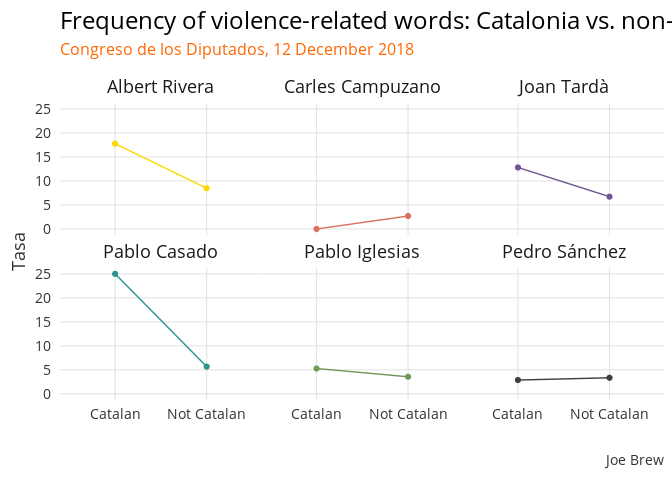

Such a high level of talk about violence is clearly not a reflection of reality - there has been no notable increase in violence in recent months, and the much discussed acts of the last weeks in which pro-independence protestors blocked roadways are arguably illegal, but certainly not violent. Rather, the high frequency of violence-related words is an *anticipatory* violence, creating a mental frame primed to interpret the upcoming protests of December 21 as war-like.

The construction of a mental framework in which Catalonia is at war is equally apparent in the speech data as in the media. Take, for example, the newspaper headlines from Friday December 14:

<table style="width:100%">
<tr>
    <td></td>
    <td></td>

</tr>
<tr>
    <td></td>
    <td></td>

</tr>
</table>
El País writes about security force increases and includes the line that the CDR (pro-independence protest groups) "llaman a dar batalla" (have called to battle). ABC uses the military words "comandos" and "asaltar" (to assault) to describe next week's planned protests. La Razón takes a similarly military-esque tone with the words "ejército" (army) and "guerrilla". Meanwhile, El Mundo front-pages an interview with former Spanish President Aznar saying that "the intervention in Catalonia should be total and without a time limit".

Just like in the congressional speeches, the newspapers are not covering real violence (of which there is not), but rather anticipatory violence. This violence, real or perceived, serves to justify both (a) continued imprisonment of political leaders and (b) direct rule over Catalonia from central Spain. It should come as no surprise that those who favor the previous two measures are also the ones most likely to evoke violence in their speeches.

Catalan language plots
----------------------

    Error in scale_y_continuous(breaks = seq(-0.4, 0, by = 0.1), labels = y_labels): object 'y_labels' not found
